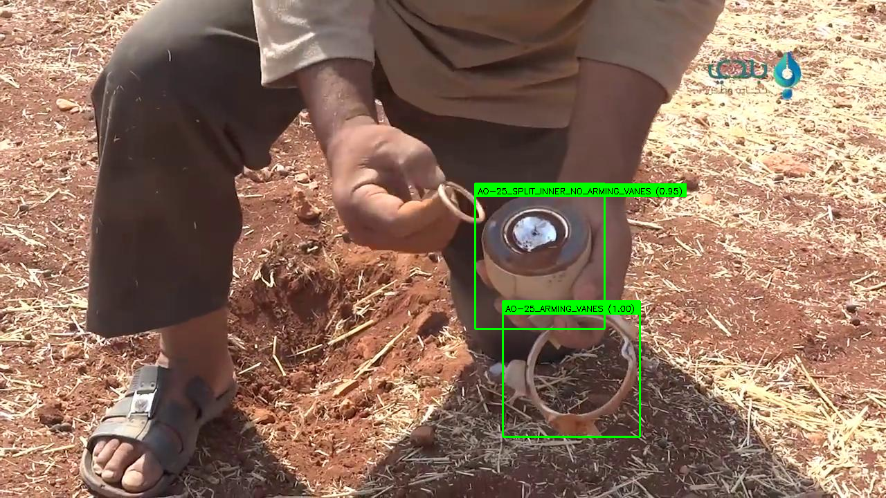

# VFRAME: Visual Forensics and Metadata Extraction

VFRAME is a computer vision toolkit designed for human rights researchers.

Demo of cluster munition detector (in progress)

**VFRAME is under development and this page will be updated often during Oct-November**

Features:
 
- fast video keyframe detection using CNN feature vectors
- modular commands for integrating with OpenCV DNN, PyTorch and other image processing frameworks
- integration with Sugarcube media collection system
- integration with VCAT metadata API, visual query, and annotation system

## Getting started

- Create conda environment: `conda env create -f environment.yml`

## TODO

October 21 - 31

- add oriented text detection polygons for EAST
- add CRNN text recognition (eng)
- add tesseract 4.0 OCR (eng, ara)
- add ROI image extraction
- intregrate FAISS build scripts from VCAT

Nov 1 - 31

- add face embedding extraction
- add options for data export to CSV for Pandas analysis
- demos for Yolo darknet training workflow
- add scripts for negative mining
- add scripts for object tracking + low-confidence detector ROI extraction
- explore options for data augmentation on aerial dataset
- develop metrics for objection detection models
- add TF OD API project builder
- add instructions for freezing/exporting TF for OpenCV compatability
- update DNN modules for OpenCV 4 (pending release)
- update image feature extractor for PyTorch 1.0
- migrate/fix keyframe detection script, integrate with PyTorch 1.0

Dec 1 - 31

- migrate JSON/Pickle (slow) to local DB (sqlite, mongo, or LMDB, hdf5)
- add pose detection test
- improve README
- give demo examples
- create demo videos
- create demo notebooks
